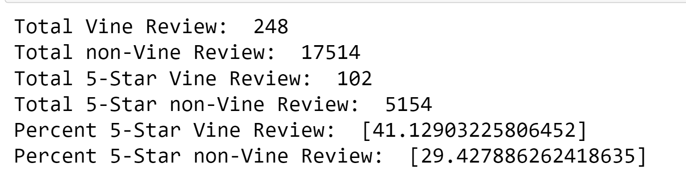
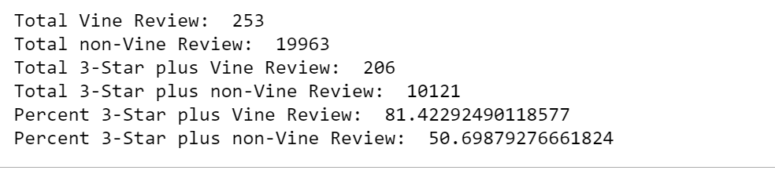
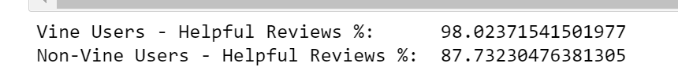

# Amazon_Vine_Analysis

## Overview
In this project, we have been tasked with analyzing Amazon reviews written by members of paid Amazon Vine program. This program allows manufactures and publishers to receive reviews for their products in exchange for a small fee.

The scope of the project is to choose a dataset from a list of approx. 50 datasets. We will then need to perform ETL process to extract data, transform and save to an AWS RDS instance. After that, we will perform data analysis to determine if there is any bias towards favorable reviews from Vine members.

In the final step, we will summarize the findings

## Resources: 
- **Images:** Under Resources folder
- **Google Colab Notebook:** Amazon_Reviews_ETL.ipynb
- **Jupyter notebook:** Vine_Review_Analysis.ipynb
- **Data file:** vine_table

## Results: 

Based on the dataset analysis filtered by total votes and helpful votes, we can infer the following
- Total non-vine review count is higher than vine user:
    - Total Vine review = 284
    - Total non-vine review = 17,514
- 5-star reviews count:
    - Vine user reviews = 102
    - Non-vine user reviews = 5154
- Percentage of 5-star review:
    - Vine user reviews = 41%
    - Non-vine user reviews = 29%

   

   

## Results: 
Based on the results above, there does seem to be positive bias for reviews in the Vine program.  Looking at the additional two analysis, we can infer that:
- Non-vine users review count is higher than Vine user review count  
- Vine users tend to give 3-star or higher ratings to the products
- Vine users reviews are also considered more helpful than non-vine users

 

**Percentage of 3-star plus reviews by Vine subscribers/non-subscribers**

   

**Overall helpful reviews by Vine subscribers/non-subscribers**

   
 
More research is needed to understand how helpful_review column is derived. It is also worth looking into how Vine program works and the perks offered with the service which may enhance user experience. Additionally, an insight into cost and terms/conditions of the Vine program can help understand why a lot of users are not Vine program subscribers.

   